# DiscoTeca

**DiscoTeca** è un'app innovativa per gli appassionati di vinili, progettata per offrire un'esperienza completa di gestione e organizzazione degli archivi di dischi in vinile. Realizzata sia per dispositivi **mobile** che per **web**, l'app consente di lavorare comodamente ovunque.

## Funzionalità principali

- **Gestione Archivio Vinili**: Organizza e gestisci la tua collezione di vinili in modo semplice e intuitivo.

- **Lista Dischi**: Visualizza tutti i tuoi dischi in un elenco ordinato con l'aggiunta dell'immagine di anteprima presa dalla prima foto della copertina del disco caricata e possibilità di visualizzarla direttamente.

- **Filtri e Ordinamento**: Trova rapidamente i tuoi dischi preferiti grazie a funzionalità avanzate di ricerca e filtro.

- **Dettaglio Disco**: Accedi a tutte le informazioni dettagliate su un singolo disco.

- **Aggiunta Rapida**: Aggiungi nuovi dischi specificando tipologia (es. giri) o posizione.

- **Aggiornamento e Cancellazione**: Modifica o elimina facilmente i dischi dal tuo archivio.

- **Login e Autenticazione**: Proteggi i tuoi dati con un sistema di autenticazione sicuro.

- **Login con Google**: Possibilità di accedere all'app tramite autenticazione con Google.

- **Aggiornamento Automatico**: Le modifiche vengono sincronizzate in tempo reale su tutti i dispositivi.

- **Modalità Chiaro/Scuro**: Possibilità di cambiare tema tra chiaro e scuro, con impostazione salvata per il dispositivo dell'utente.

- **Caricamento Immagini Disco**: Possibilità di caricare e salvare le foto fronte e retro per ogni disco.

- **Ritaglio dell'immagine**: Possibilità di ritagliare la foto del disco durante il caricamento.

- **Scannerizzazione AI delle Copertine**: Possibilità di scansionare tramite intelligenza artificiale le foto del disco per compilare automaticamente le informazioni come titolo album, nome artista e tracklist.

- **Ordinamento Automatico**: Ordinamento automatico durante la selezione della posizione del disco per velocizzare il caricamento.

- **Onboarding Utente**: Un sistema di onboarding guida gli utenti attraverso le funzionalità principali dell'app.

- **Aggiornamento dell'app**: L'app si aggiorna automaticamente all'uscita di nuove versioni per garantire sempre la migliore esperienza utente.

## Architettura

L'app è sviluppata utilizzando **Cubit** per una gestione dello stato reattiva e scalabile. È implementata seguendo i principi di **clean architecture**, assicurando modularità e mantenibilità del codice.

## Tecnologie

DiscoTeca sfrutta le potenzialità di **Firebase**, utilizzando i seguenti servizi:

- **FirestoreDatabase**: Per la memorizzazione e sincronizzazione dei dati.
- **FirebaseAuth**: Per la gestione sicura degli accessi e dell'autenticazione.
- **FirebaseRemoteConfig**: Per aggiornamenti dinamici delle configurazioni e delle funzionalità dell'app.
- **FirebaseStorage**: Per la gestione del salvataggio delle foto.
- **ChatGPT (modello GPT-4o-mini)**: Utilizzato come servizio API per la decodifica delle immagini.

## Perché scegliere DiscoTeca

Se sei un amante dei vinili e vuoi tenere sotto controllo la tua collezione in modo semplice e accessibile, DiscoTeca è l'app che fa per te. Che tu sia a casa o in movimento, su smartphone o desktop, l'app ti accompagna ovunque!

Inizioa ad usare subito DiscoTeca e rivoluziona il modo in cui gestisci la tua collezione di vinili!

[Accedi all'app web](https://disco-teca.web.app/)

[Download l'ultima versione dell'app mobile](https://github.com/dalle95/disco_teca/releases/latest)

## Screenshot & Anteprime

Ecco alcune anteprime dell'app DiscoTeca per la versione mobile.

### 📱 Mobile
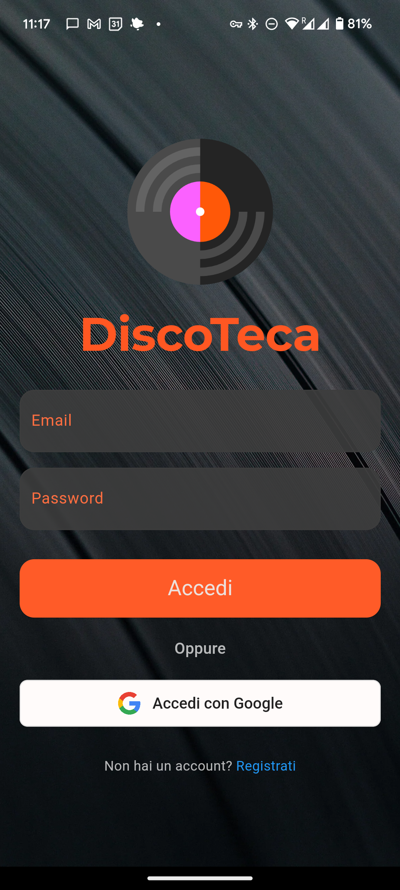
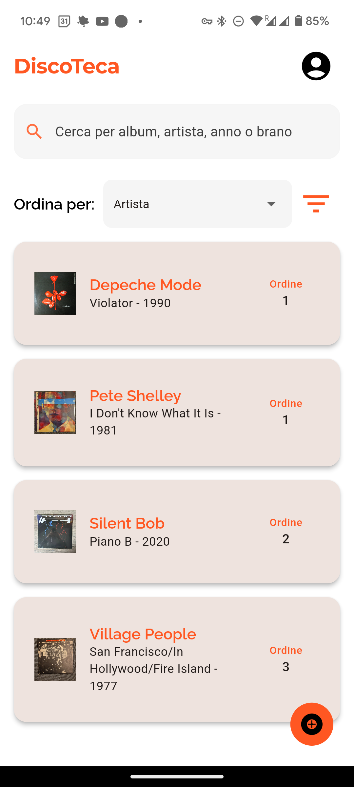
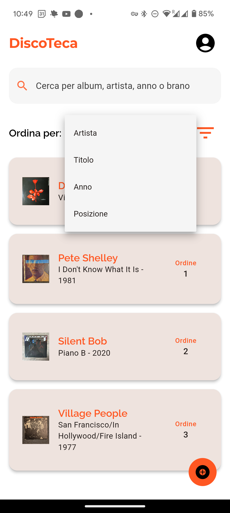

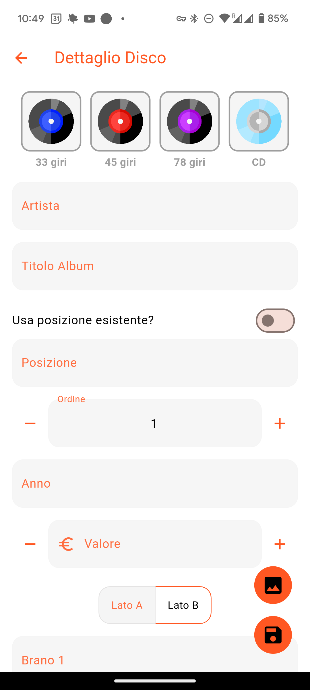
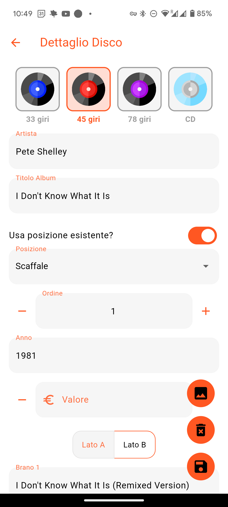
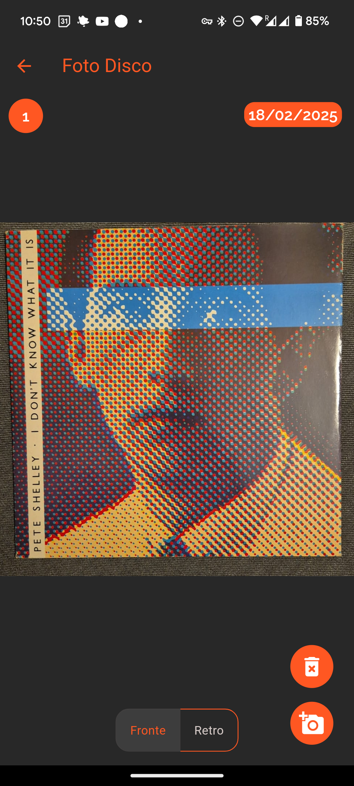
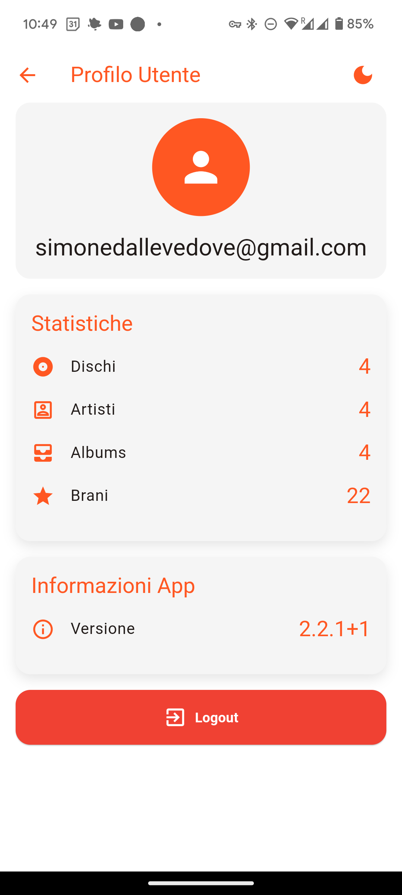
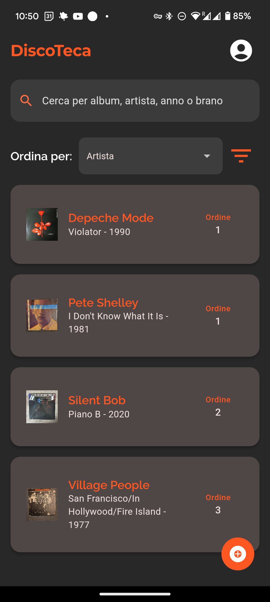

### 💻 Web
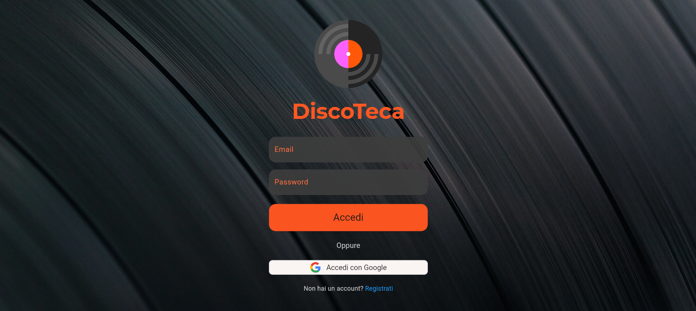
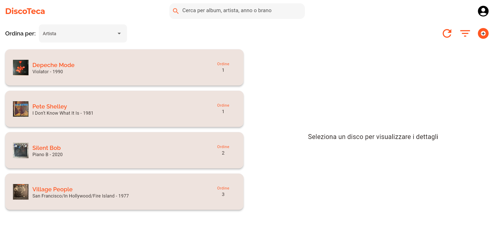
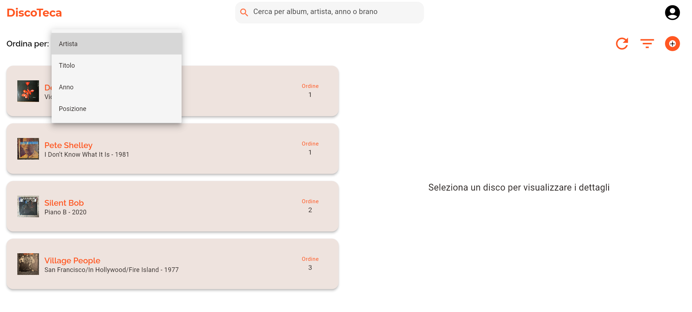
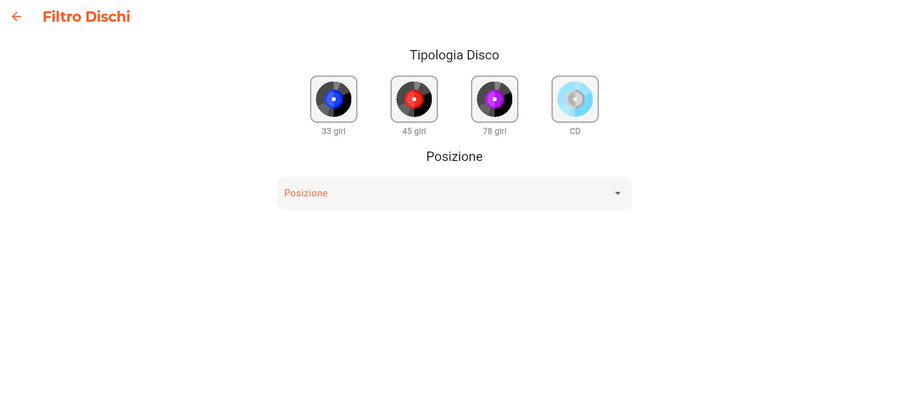
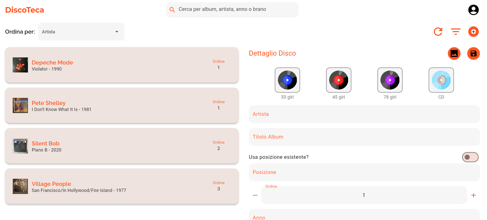
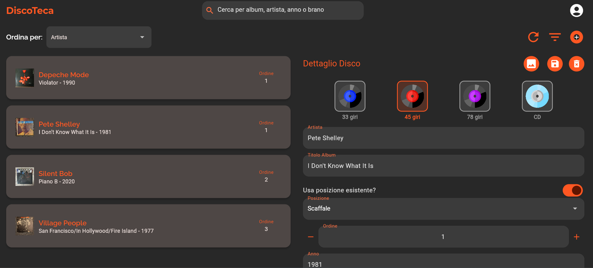
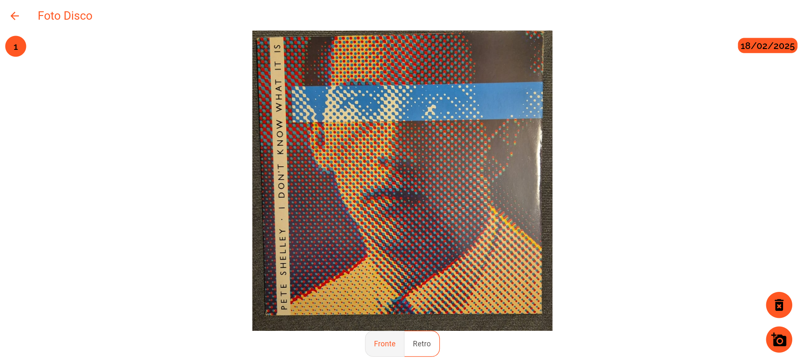
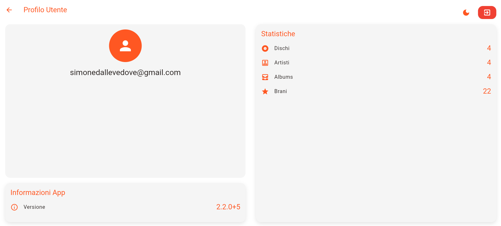
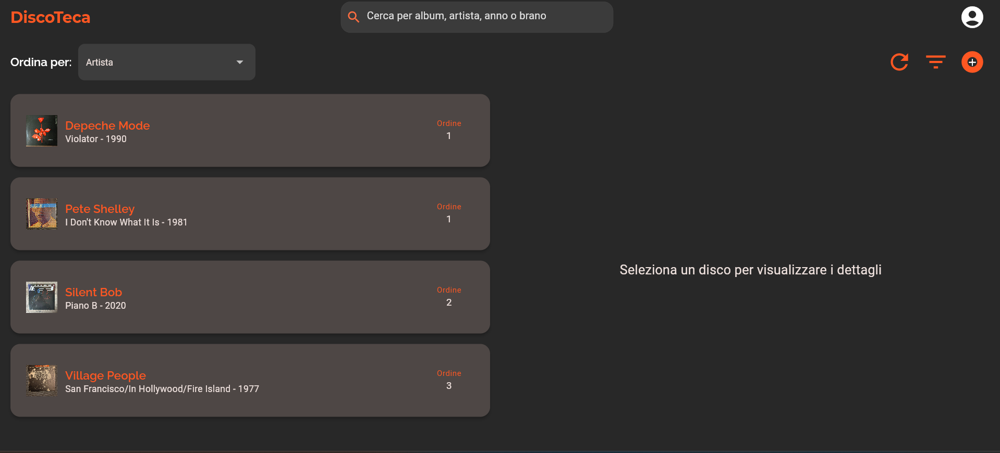
